# 02. Подготовка лабораторной

<iframe width="560" height="315" src="https://www.youtube.com/embed/O-Q5dL0TyWE" title="YouTube video player" frameborder="0" allow="accelerometer; autoplay; clipboard-write; encrypted-media; gyroscope; picture-in-picture" allowfullscreen></iframe>

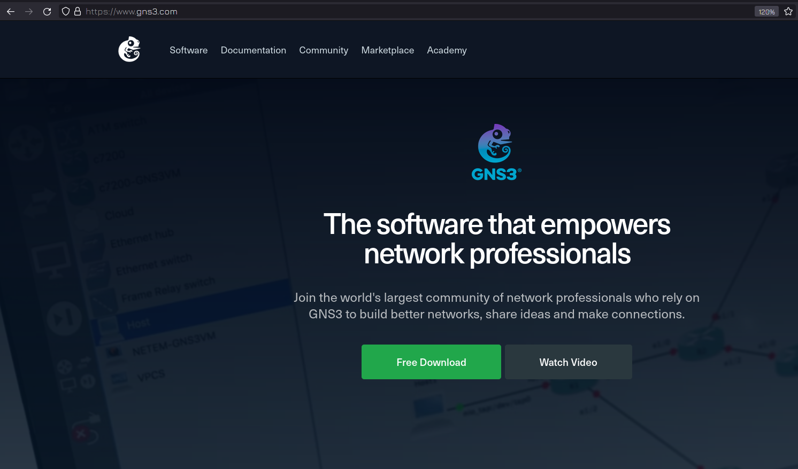

Теперь, когда мы знаем, как должна выглядеть инфраструктура, давайте попытаемся её построить. Ну и самое главное - разберём программную часть этого всего. Нам понадобится много виртуалок и мы будем их связывать с помощью виртуальной сети. Всё это можно сделать и в VirtualBox-е, но это не будет наглядно. Поэтому нам нужна программа [GNS3](https://www.gns3.com/).

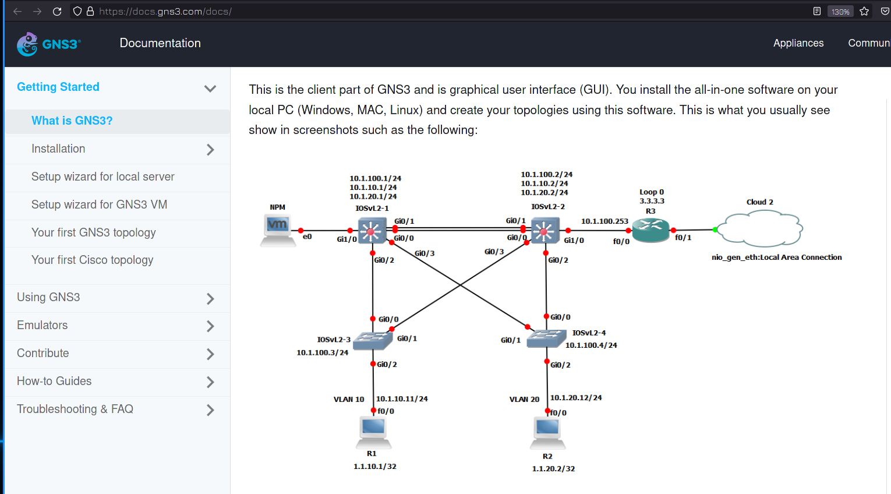

Мы всё ещё будем использовать VirtualBox, чтобы работали виртуалки с линуксами, но за сеть и за наглядность будет отвечать GNS3. Сразу предупрежу, что она немного требовательная и рекомендуемый минимум по оперативке где-то 8 гигабайт. На самом деле, если ваша система использует мало памяти, то можно обойтись меньшей памятью. Я буду строить большую сетку с кучей виртуалок, вам же не обязательно так делать. Для разбора большинства тем хватит 3-4 одновременно запущенных виртуалок.

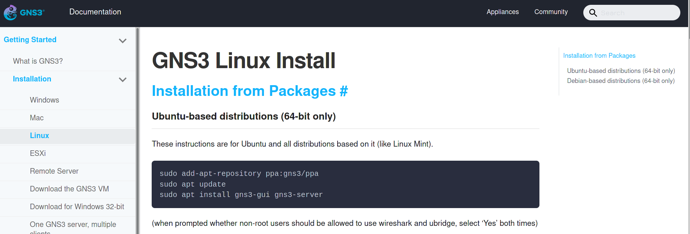

Если у вас основная система GNU/Linux, то вам для установки нужно будет добавить репозиторий, установить несколько пакетов и добавить вашего пользователя в несколько групп. Всё зависит от вашего дистрибутива, для убунту и дебиан инструкцию можно найти в документации на официальном сайте, а для других дистрибутивов есть статьи в интернете.

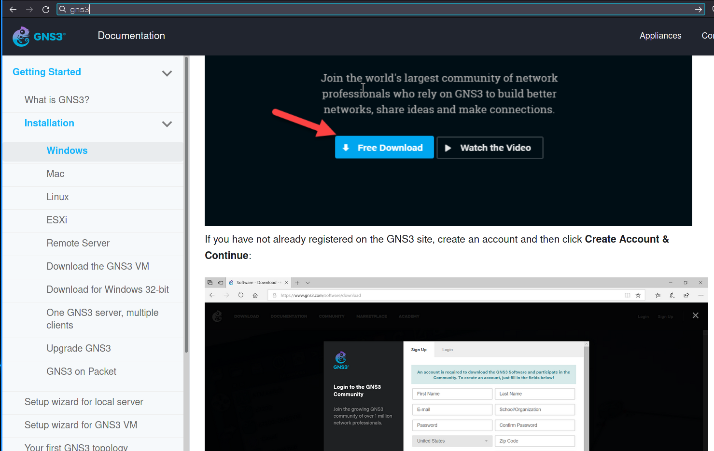

Что касается Windows, в официальной документации также есть инструкция, но там много лишнего, поэтому я покажу сам. 

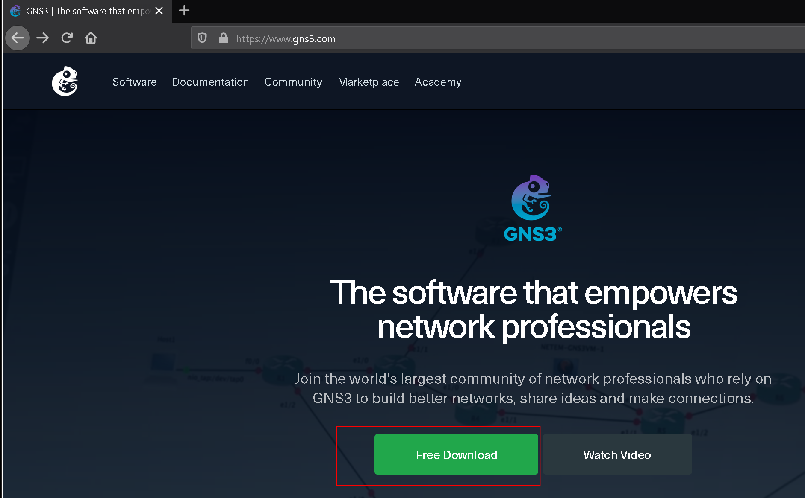

На официальном сайте GNS3 нажимаете Free Download, после чего вам нужно будет зарегистрироваться, чтобы скачать. 

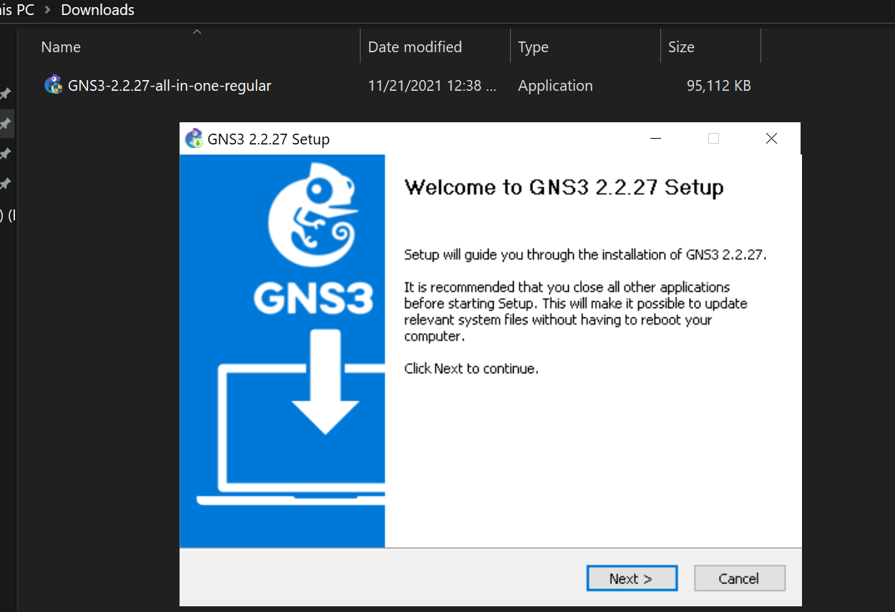

Дальше запускаете установщик, нажимаете Next, соглашаетесь с лицензией и ещё раз "Next".

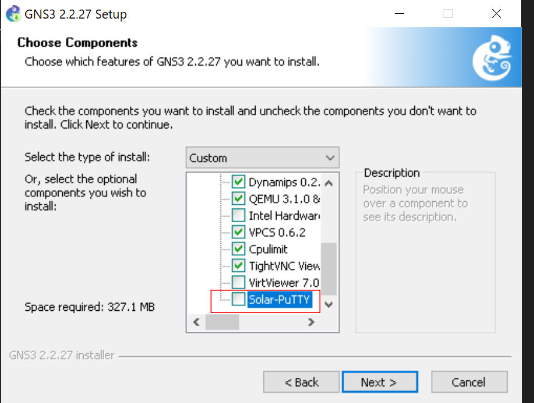

Во вкладке выбора компонентов раскрываете Tools и убираете галочку с Solar-Putty. Это ssh клиент, чтобы мы могли подключаться к оборудованию. Мы же всё равно будем использовать другую утилиту - MobaXterm. После чего нажимаем Next.

Пока опять не появится окно с предложением бесплатно получить лицензию для SolarWinds Standard Toolset - это набор утилит для мониторинга сети. Нам это не нужно, мы будем делать свой мониторинг сети, поэтому нажимаем No. На этом завершаем установку и запускаем GNS3.

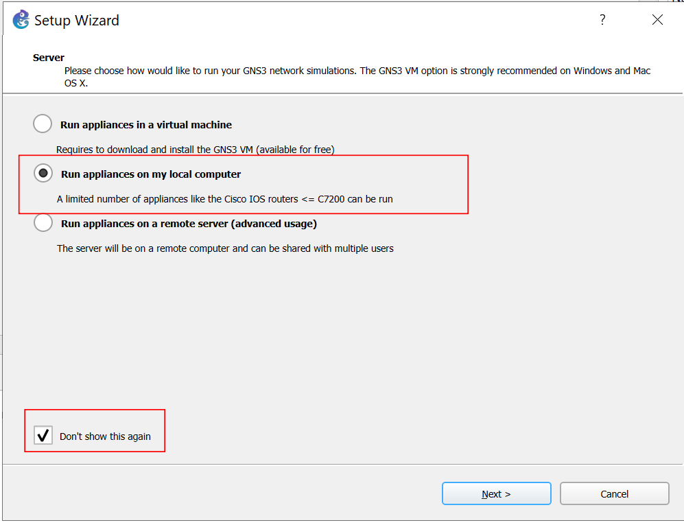

Нас встретит окно с начальными настройками и спросит, где мы будем запускать виртуальное оборудование. У GNS3 есть своя готовая виртуалка с линуксом, но мы всё равно все наши системы будем запускать через VirtualBox, и, чтобы не ставить лишнюю виртуалку, выбираем второй пункт и ставим галочку на "Больше не показывать". Затем Next, Next и finish.

Также скачиваем и ставим [MobaXterm](https://mobaxterm.mobatek.net/). С помощью неё мы будем подключаться к нашим виртуалкам по SSH. Установка довольно простая - просто next next и всё.

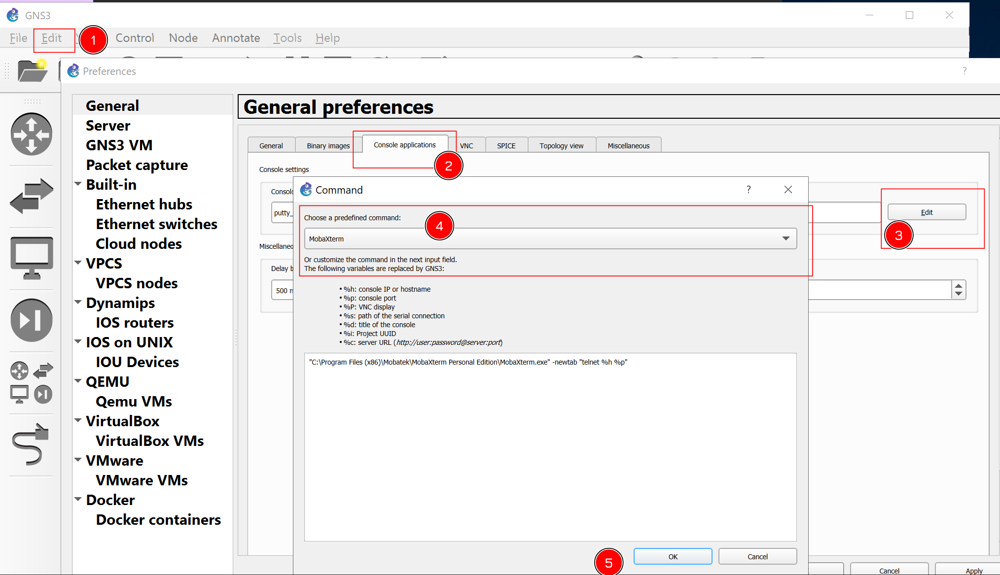

После чего в GNS3 заходите в Edit - Preferences - General - Console Applications - Edit и выбираете Mobaxterm. Затем нажимаете OK и Apply.

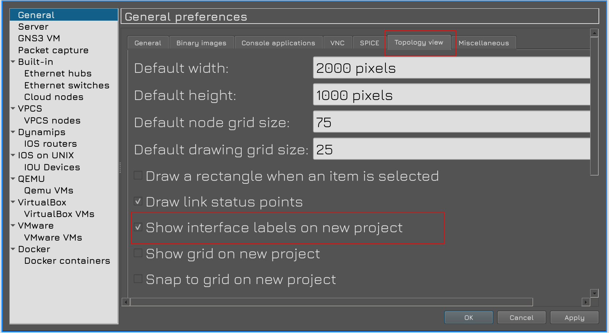

Также во вкладке Topology ставите галочку на "Show interface labes on new project". Это будет показывать нам названия интерфейсов, подключенных к сети, что будет полезно в будущем.

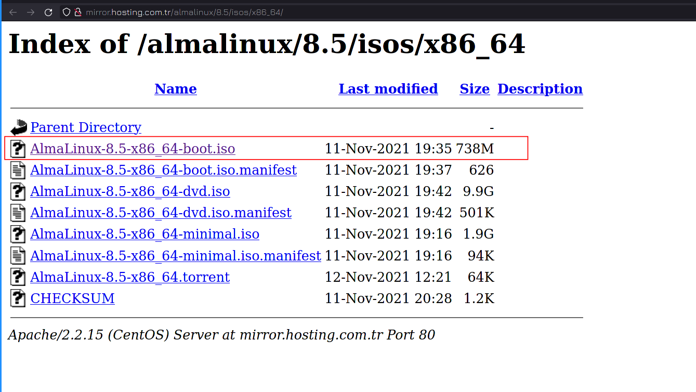

Также, из-за того, что мы часто будем создавать и удалять виртуалки, будет неудобно их постоянно регистрировать, поэтому вместо RHEL используем AlmaLinux - это один из дистрибутивов, который появился на замену Centos. Скачать его можно с официального сайта по [ссылке](https://almalinux.org/). Архитектура x86_64, а версию берите последнюю. Я не буду разбирать установку, она ничем не отличается от установки RHEL или Centos. Вы можете использовать любой другой дистрибутив, но желательно всё таки Alma, чтобы избежать путаницы в названиях пакетов и прочих мелочах.

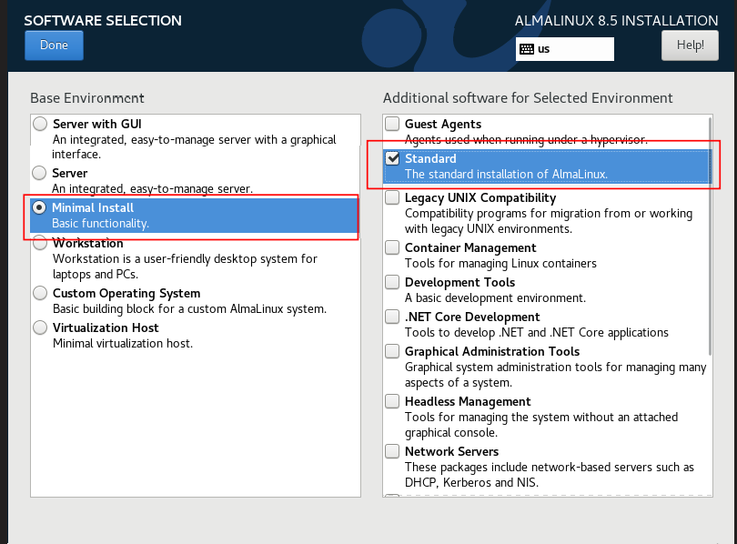

Что касается параметров виртуалки, назовите виртуалку просто "alma". Для установки можете выделить 1 гигабайт оперативки и 16 гигабайт дискового пространства. Среди пакетов выберите минимальную установку со стандартными пакетами.

Всё остальное на ваше усмотрение. 

После создания виртуалки выключите её и создайте её клон. Он вам понадобится, чтобы быстро восстановить виртуалку, если вдруг что-то с ней случится. Всё дело в том, что GNS немного капризный в работе и можно случайно попортить связь между GNS3 и VirtualBox. Поэтому и создадим клон на всякий случай.

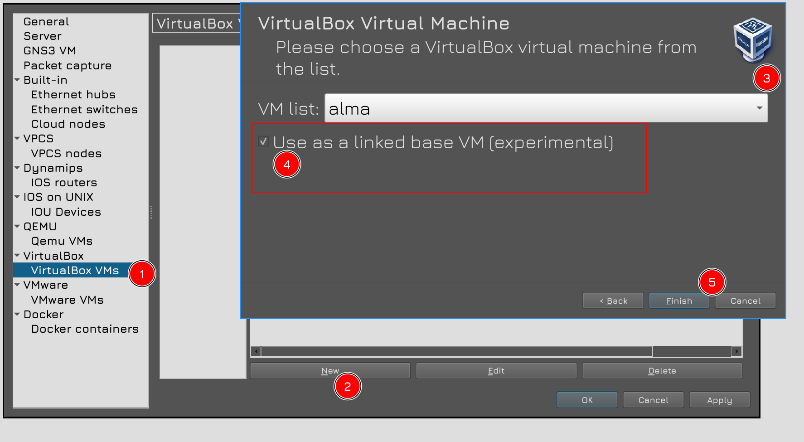

После создания виртуалки возвращаемся в настройки GNS. Теперь во вкладке VirtualBox VMs нажимаем New и из списка виртуалок выбираем alma. Не забываем поставить галочку "Use as a linked base VM", что позволит нам простым перетягиванием создавать новые виртуалки, используя эту как образ.

Затем в списке слева появится alma. Нажимаем на неё - Edit - меняем количество оперативки на 512MB и ставим галочку "Start VM in Headless mode". Это позволит запускать виртуалку без нового окна с консолью, так как мы всё равно будем подключаться по SSH.

Затем во вкладке Network меняем количество адаптеров на 4 и ставим галочку внизу, чтобы разрешить GNS3 управлять сетевыми адаптерами виртуалбокса. После чего нажимаем OK и Apply.

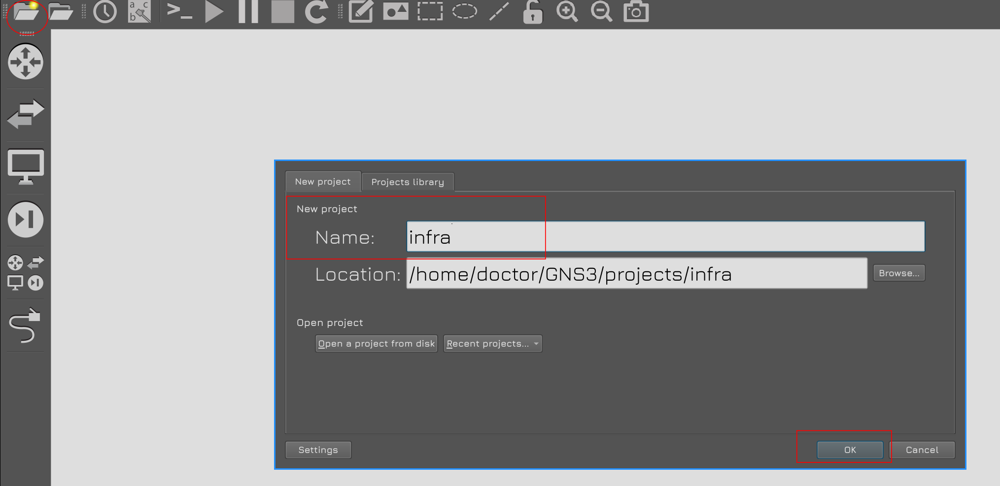

Закрываем окно настроек и нажимаем на иконку "New blank project" в верхней панели. В появившемся окне даём имя нашему проекту, по необходимости выбираем директорию и нажимаем OK. 

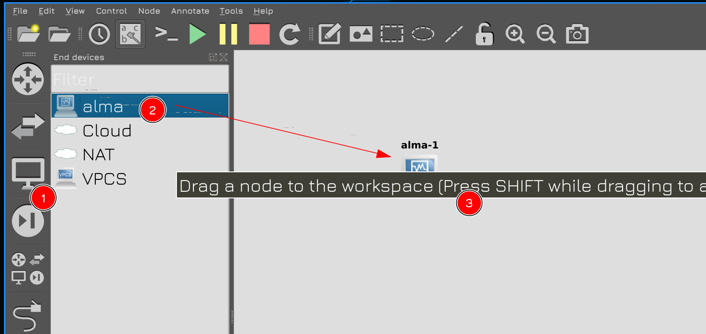

Затем нажимаем на иконку монитора в левой панели - откроется панель с устройствами, среди которых наша alma. Попробуем перетянуть её в центральную часть. 

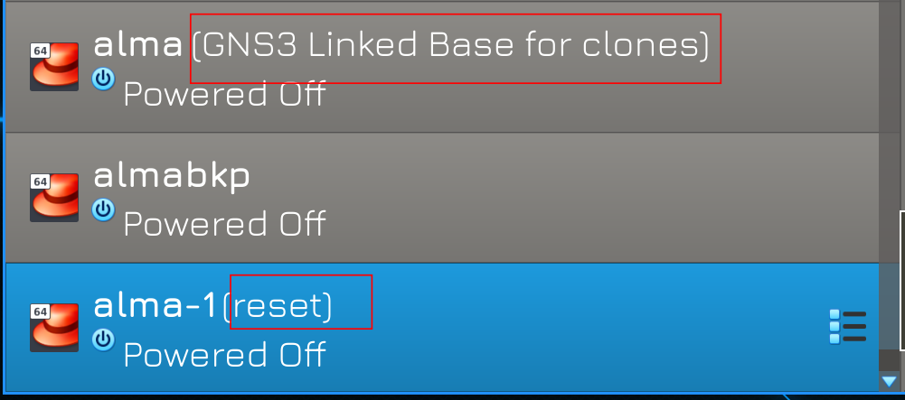

При этом создаётся копия виртуалки. В самом виртуалбоксе можно будет увидеть эту виртуалку, ну и у этих двух виртуалок в названии появятся метки. Не трогайте эти виртуалки в VirtualBox - не удаляйте и ничего не меняйте. Ими управляет GNS, и, как я говорил, GNS очень капризный. Если вы случайно удалите виртуалку или что-то в ней испортите, то весь ваш проект в GNS перестанет запускаться, а для его восстановления придётся не мало повозиться. Когда вы будете закрывать GNS, виртуалки из проекта будут пропадать из виртуалбокса, а при запуске проекта - появляться. 

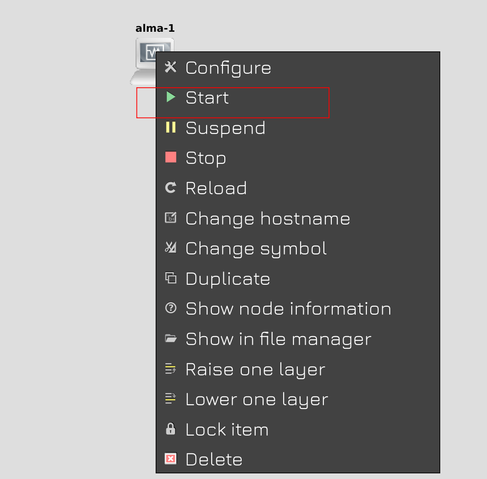

Теперь попробуем запустить виртуалку. Для этого в GNS нажмите правой на ней и нажмите Start.

После чего в виртуалбоксе видно, что виртуалка запустилась. Значит всё окей.

Чтобы выключить виртуалку, опять же, в GNS нажимаем правой кнопкой мыши на виртуалке и нажимаем Stop. Всегда перед выходом из GNS предварительно выключайте все виртуалки.

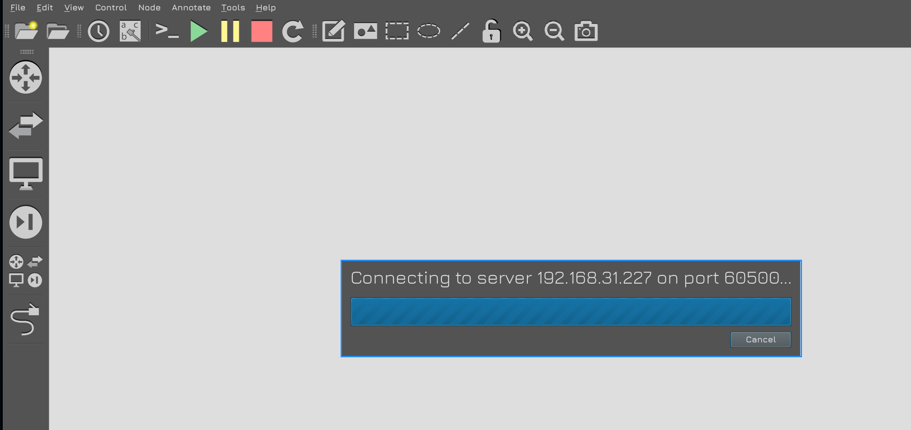

Ну и всегда при запуске GNS дожидайтесь, чтобы отработал его запуск и появилось окно с выбором проектов. Иногда это может занять время, но лучше подождать.

Есть другие программы по типу GNS, есть другие гипервизоры, другие ssh клиенты, другие дистрибутивы - и вы вольны использовать всё что угодно. Но я работал именно с такой связкой, поэтому, если у вас возникнут проблемы - с этими инструментами мне будет легче вам помочь. 