# 03. Деление на VLAN-ы

<iframe width="560" height="315" src="https://www.youtube.com/embed/71xFJaHMiNA" title="YouTube video player" frameborder="0" allow="accelerometer; autoplay; clipboard-write; encrypted-media; gyroscope; picture-in-picture" allowfullscreen></iframe>


Давайте начнём строительство инфраструктуры с того элемента, который всё связывает - со свитчей. Если вы не знакомы с сетями, советую предварительно посмотреть 42 и 43 тему из курса "Основы GNU/Linux". Нажмите в левой панели GNS на иконку с двумя стрелками, выберите Ethernet Switch и перетащите на центральную часть. Официальное название свитча на русском - коммутатор, ну или сетевой коммутатор. А иконка в GNS - общепринятое обозначение. Сразу скажу, что обычно со свитчами работает сетевой администратор, но у сисадмина должно быть представление, всё таки он отвечает за подключение серверов к свитчам и должен уметь кое-что настраивать со своей стороны. Ну и в маленьких компаниях, нередко системный администратор также отвечает за настройку сети. 

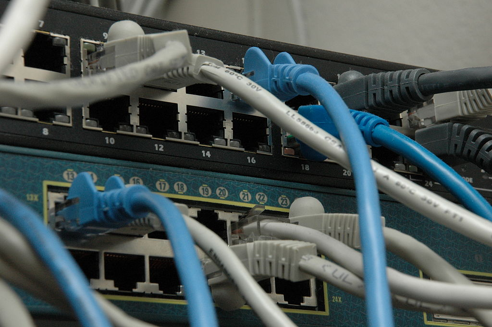

Свитч в реальности - это такое устройство, состоящее из кучи портов. В этом его основное предназначение - пересылать трафик с кабеля, воткнутого в один порт, на кабель, воткнутый в другой порт. Хотя бывают и маленькие свитчи на 5-8-12 портов, но, в средних и крупных компаниях, вы, чаще всего, будете встречать 24 или 48 портовые. В наше время большинство портов на свитчах гигабитные, при этом бывают порты на 10 гигабит, 25, 40 и даже 100. Теоретически, свитчом может быть и обычный компьютер, но когда речь идёт про большие скорости, на свитчах стоят специальные чипы, которые быстрее обрабатывают трафик.

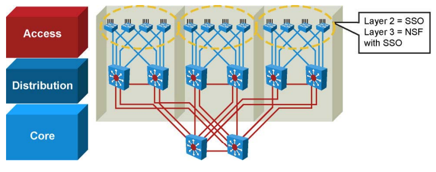

В зависимости от задач, сетевики делят свитчи на несколько уровней - access, ditribution и core. Access свитчи обычно стоят на каждом этаже здания, у них много ethernet портов и они в основном предназначены для подключения пользователей, принтеров и прочего подобного оборудования. Витую пару нельзя делать больше 100 метров, иначе сигнал в проводах просто затухает. Поэтому, если здание большое, на каждый этаж ставят по одному или несколько access свитчей. А эти свитчи с помощью оптических кабелей на 10 гигабит подключают к другим свитчам - distribution. Порты, соединяющие одни свитчи с другими называют аплинками - т.е. эдакий выход из свитча. А distribution свитчи в свою очередь подключены к core свитчам - куда стекается весь трафик. Скорости, на самом деле, зависят от размера инфраструктуры и количества трафика - в маленькой инфраструктуре нет смысла иметь такую топологию и такие скорости. Но, когда инфраструктура растёт, всё сводится к такой схеме.


В местах, где стоят компьютеры или прочие конечные устройства - назовём их endpoint-ами - на стене или в полу делают специальные сокеты, куда и вставляется медный провод.


Эти сокеты ведут к небольшим рэкам, где также выводятся в виде сокетов, но уже в один или несколько рядов. Это называется патч-панелями. А из патч-панели же идут патч-корды к access свитчам. Сокет в патч-панели, соединённый с сокетом у пользовательского компьютера, маркируют одинаково. Условно, на патч-панели всё в числовом порядке - 1, 2, 3 и т.п. И сокет, стоящий за первым портом патч-панели - тоже маркируют 1, не важно, в какой комнате он находится. А дальше нужно маркировать кабель, идущий от патч-панели к свитчу - чтобы было понятно, к какому порту какого свитча подключается 5 сокет с патч-панели.  И завтра, если нужно будет что-то сделать, подойдя к компьютеру можно будет увидеть, что на сокете написано 5, а значит нужно смотреть пятый порт на патч-панели. А там уже по маркировке будет видно, на какой порт свитча идёт кабель. Потому что проводов может быть много и разобраться без маркировки становится сложно.

Правильная и актуальная маркировка - это задача IT отдела, в том числе системного администратора. И если вам попался хороший подрядчик, который провёл кабели, поставил сокеты и всё промаркировал - это здорово. Но это вы администрируете инфраструктуру, завтра вы купите новые свитчи, замените кабели, что-то поменяете - поэтому старайтесь держать маркировку актуальной.


Ну и в серверной, подключая различные провода к серверам и прочему оборудованию - не важно, электричество, ethernet и прочее - также обязательно всё маркируйте. Для этого есть специальные устройства, которые на клейкой ленте печатают текст - они называются label-printer. И старайтесь всю маркировку держать согласно какому-то стандарту - нужно очень кратко и точно описывать, что куда подключено. 

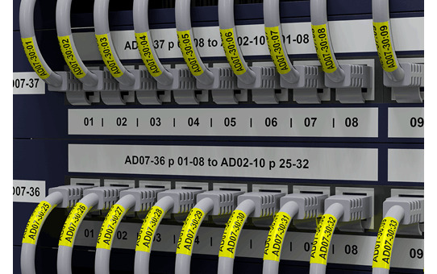

Скажем, с одной стороны электрического провода пишете, что он ведёт на 3 порт первого UPS-а, а на другом конце, который подключен к UPS-у - пишете, что этот кабель ведёт на второй блок питания третьего сервера. И всё это надо уместить в пару символов на тоненькой бумажке, причём так, чтобы просто взглянув на неё было понятно, что это и куда ведёт. Чтобы в случае проблем вы случайно не выдернули не тот провод и окончательно всё не испортили. Даже если у вас будет куча кабелей, вы всегда разберётесь - какой провод с чем связан и куда ведёт. Чуть больше про маркировку и порядок в серверной вы можете почитать по ссылкам - [1](https://habr.com/ru/post/119609/), [2](https://www.oborud.info/news/2021/?t=15800).


Мы же вернёмся к свитчам. Как бы не казалось, что они выполняют простую задачу, в них огромный функционал, особенно у современных свитчей. Но основная их задача - связывать тех, кто хочет связаться. В модели OSI это второй уровень - канальный, часто называемый L2, т.е. layer 2. На этом уровне устройства друг к другу обращаются по MAC адресам, а свитч запоминает, за каким портом какой MAC адрес находится. Для этого у свитча есть MAC-адресная таблица. 


Чтобы понять и увидеть это, давайте возьмём 3 хоста. Сделайте так, чтобы у вас на схеме был 1 свитч и 3 виртуалки с alma, т.е. 3 раза перетяните alma в центр. Затем в левой панели кликните на последнюю иконку, напоминающую провод, потом нажмите на свитч, выберите Ethernet0 и затем на alma-1. Ещё раз нажмите на свитч, выберите Ethernet1 и нажмите на alma-2. Повторите тоже самое для alma-3. Затем нажмите правую кнопку мыши или на иконку провода. Так мы подключили всё в одну сеть. Обратите внимание, рядом с alma появились надписи - e0 - это говорит о том, что мы подключили провода к нулевым адаптерам. Мы в прошлый раз для виртуалок настроили 4 адаптера, соответственно, названия будут e0, e1, e2 и e3. Со стороны свитча же подключено три провода - e0, e1 и e2.

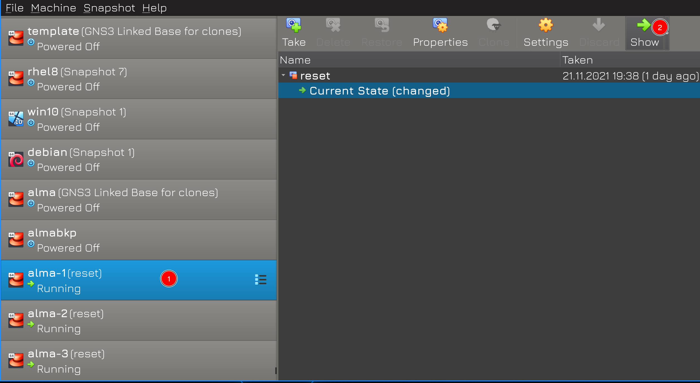

После этого запустим все 3 виртуалки. Так как наша сеть пока не готова, по ssh я к ним подключиться не смогу. Поэтому на этот раз прибегнем к консоли виртуалок. Запустите виртуалбокс, выберите запущенные виртуалки и нажмите show.


Затем назовите каждую систему соответственно - alma1, alma2, alma3:

```
hostnamectl set-hostname alma1
hostnamectl set-hostname alma2
hostnamectl set-hostname alma3
```

Ну и перелогиньтесь, либо запустите bash, чтобы в приглашении консоли отображалось новое имя. Это позволит нам не путаться. 


Теперь посмотрим список интерфейсов:

```
ip a
```

Как видите, в системе отображаются 4 интерфейса помимо loopback. И только один из них в UP-e - enp0s3. Значит он соответсвует интерфейсу e0, который мы видели в GNS. На интерфейсах нет IP адресов, потому что в этой сети есть только 3 хоста и свитч - и никакого DHCP сервера, который бы раздавал IP адреса. 


Давайте выдадим каждой машинке по временному адресу, сеть 10.0.0.0 и адреса 1,2,3 соответственно:

```
ip address add 10.0.0.1/24 dev enp0s3
ip address add 10.0.0.2/24 dev enp0s3
ip address add 10.0.0.3/24 dev enp0s3
```

Маску выставим /24. Про IP адреса мы поговорим в другой раз, поэтому сегодня обсусловимся чем-то дефолтным. Такая маска нам говорит, что в нашей сети находятся все адреса от 10.0.0.0 до 10.0.0.255. Нам этого хватает. Давайте убедимся, что IP адрес появился на интерфейсе:

```
ip addr show enp0s3
```

Как видите, адрес прописался. Ну и проверим ещё вывод команды:

```
ip ro sh
```

Здесь мы видим, что до любого хоста из сети 10.0.0.0/24 можно подключиться напрямую через интерфейс enp0s3. Пропишите адреса на всех 3 хостах.


Теперь на втором и третьем хосте запустите команду tcpdump:

```
tcpdump
```

Она позволит увидеть информацию по всем приходящим пакетам.


После чего идём на первый хост и отправляем один пинг на второй хост:

```
ping -c 1 10.0.0.2
```

Как видите, пинг сработал,  значит сеть работает. 


Теперь идём смотреть на хост 3. Видите, tcpdump выдал строчку - ARP запрос - тот у кого адрес 10.0.0.2 ответьте 10.0.0.1. И тишина. Дело в том, что alma1 пыталась достучаться до адреса 10.0.0.2. Но она знает только IP адрес, а общение в L2 сети идёт по MAC адресу. Поэтому хост послал специальный ARP запрос - всем хостам в сети рассылается вопрос - мол, у кого такой айпи адрес, скажи свой мак адрес. Этот запрос пришёл и на третий хост, но у него айпи адрес не такой, поэтому альма3 проигнорировала это сообщение.


Давайте посмотрим, что произошло на хосте 2. Как видите, тут уже сообщений побольше. Сперва мы видим тот же ARP запрос, но теперь на него есть ответ - reply. В ответе сказано, что такой-то адрес находится за таким-то мак адресом. Не обращайте внимание на слово alma2, это утилита tcpdump для удобства превратила адрес в имя. После этого прилетает ICMP запрос - это уже сам пинг. Причём, обратите внимание, что через некоторое время опять был arp запрос. Чтобы избежать проблем, мол, мало ли, этот IP адрес окажется на другом компьютере, arp таблица периодически обновляется. 


И сделав это, оба хоста запомнили друг друга по мак адресу:

```
arp -a
```


И теперь, если повторить попытку пинга, можно увидеть, что запрос сразу дошёл до хоста 2. 


При этом, обратите внимание, что на хосте 3 как был один запрос, так он и остался. 

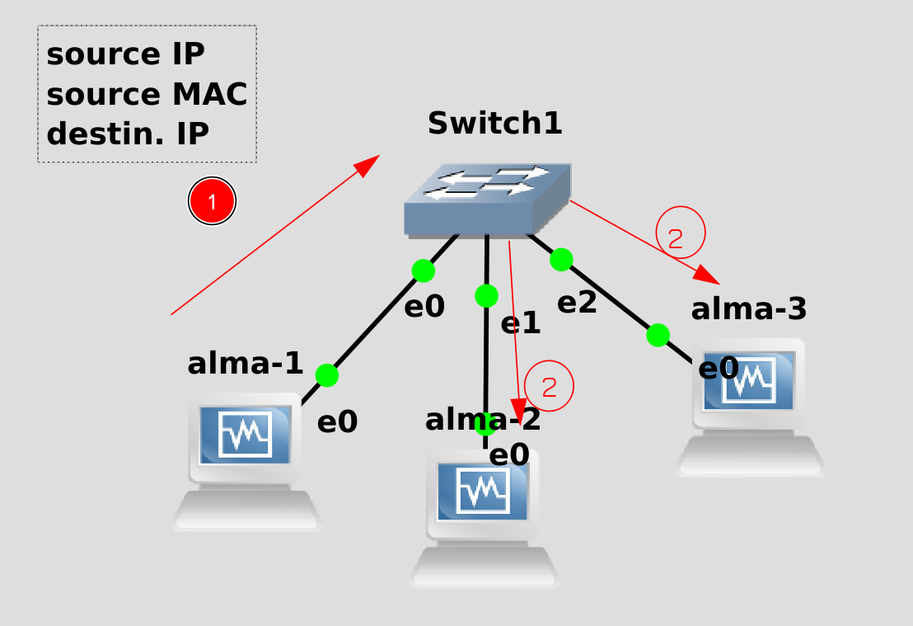

Теперь попытаемся понять, какова была роль свитча. Когда альма1 попыталась найти альму2, она отправила сетевой пакет, в котором был её IP адрес, её мак адрес и IP адрес альмы2. В тот момент ни хост 1, ни свитч не знали мак адрес хоста 2. И поэтому хост 1 решил обратиться ко всем - это называется broadcast - т.е. широковещательный запрос. Свитч этот запрос разослал по всем своим портам, кроме того, откуда пришёл запрос. Вся эта область, откуда приходит и куда доходит broadcast запрос называется broadcast доменом. Грубо говоря, представьте, что кто-то крикнул в одной комнате и все в этой комнате услышали этот крик. Крик - это broadcast запрос, а комната - broadcast домен. В итоге запрос прилетел на хост 2 и хост 3. При этом свитч записал Source MAС адрес хоста 1 к себе в таблицу, мол, за портом Ethernet0 находится такой-то MAC адрес. 


Хост 2, получив запрос, взял из пакета Source IP и Source MAC, подготовил ответ и указал их в качестве Destination. Добавил к этому пакету свой IP и MAC и отправил. Свитч, увидя этот пакет, запомнил Source MAC альмы 2, мол, за портом Ethernet1 находится такой-то MAC адрес. Также свитч увидел, что в пакете указан Destination MAC адрес. А свитч то этот МАК помнит - он его на предыдущем шаге себе записал. Вот он сразу этот пакет на порт Ethernet0 и отправил.

Теперь, когда эти два мак адреса будут пытаться что-то передавать друг другу, свитч сразу будет отправлять на нужные порты, при этом никак не трогая альму3.

Вы спросите - а какой нам в этом толк? Как это относится к сисадминству? На самом деле, главное, зачем мы это рассмотрели - чтобы познакомиться с понятием broadcast domain. Понятие broadcast используется как на l2 уровне, так и на l3, мы сейчас говорим исключительно про l2. И чтобы лучше это понять, давайте кое-что изменим в нашем эксперименте.


Поменяем на альме 1 и 2 IP адреса, а точнее сеть, чтобы теперь они находились в сети 10.0.1.0:

```
ip addr del 10.0.0.1/24 dev enp0s3
ip addr add 10.0.1.1/24 dev enp0s3
ip addr del 10.0.0.2/24 dev enp0s3
ip addr add 10.0.1.2/24 dev enp0s3
```

А хост 3 оставим в сети 10.0.0.0. Теперь, на уровне L3, они находятся в разных сетях, и, соответственно, разные broadcast-ы на уровне L3. А вот на уровне L2.. давайте убедимся. 


Для этого, опять же, на хосте 3 запускаем tcpdump и пытаемся с первого хоста пингануть второй:

```
ping -c 1 10.0.1.2
```

И, как видите, третий хост всё равно получил запрос, даже если у него сеть другая. broadcast на уровне l2 - общий. Т.е. компьютерам достаточно сменить IP адреса и они будут видеть друг друга. 

Теперь вопрос - а зачем вообще компьютеры делить на сети, почему бы всё не держать в одной общей сети? Как и с виртуализацией и контейнерами - нужно всё изолировать. К вам в компанию приходят гости и им нужен интернет. Стоит ли их пускать в ту же сеть, что и сервера? Конечно, нет, мало ли что у них на ноутах и телефонах крутится. А стоит ли пускать в ту же сеть ваших юзеров? Даже если вы им доверяете больше, они запросто могут не знать базовые принципы информационной безопасности. А уж в больших сетях о доверии речи быть и не может. У одних юзеров должен быть доступ на одни ресурсы, у других пользователей на другие. Есть начальство, бухгалтерия, айти и прочие отделы - и у всех различные уровни доступа. Поэтому сеть нужно делить и изолировать. Это называется сегментацией. Чем больше вы изолируете всё друг от друга, тем сложнее становится всем управлять, но и в случае проблем ущерб будет минимальный.

Как мы выяснили, деление просто по разным IP сетям совсем не выход, компьютеры всё равно могут друг друга видеть, потому что находятся в одном broadcast домене. Как тогда быть?

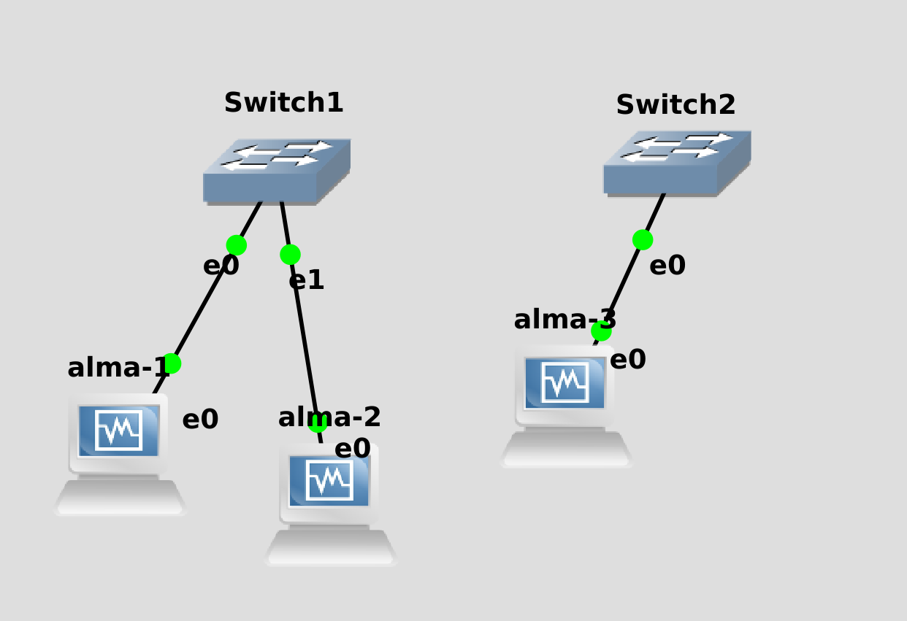

Можно, конечно, поставить второй свитч. Но это как с отдельным сервером для каждого сервиса - очень дорого и бессмысленно. У вас сегодня в отделе 5 человек, завтра 10, послезавтра 8. Вам либо для каждого отдела придётся кучу свитчей покупать, а если отдел сидит по разным этажам и зданиям - вообще беда. Конечно же, это не выход. И здесь вам приходит на помощь виртуальная сеть - Virtual LAN - VLAN. 

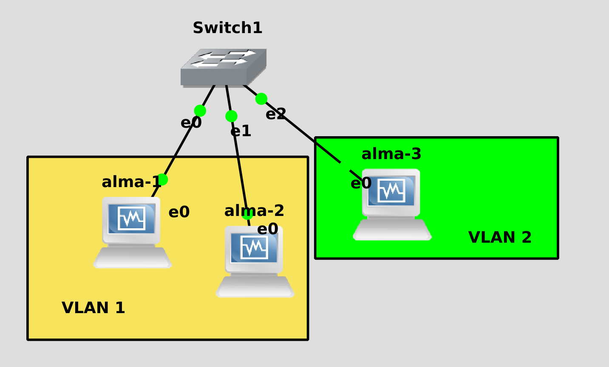

VLAN-ы помогают создавать поверх одной физической сети разные broadcast домены. У вас устройства всё ещё будут подключены к одному свитчу одним кабелем, но они будут видеть только те хосты, которые с ними в одной виртуальной сети, в одном VLAN-е. В средних и крупных компаниях могут быть десятки, а то и сотни VLAN-ов. И, по хорошему, в одном влане живёт только одна сеть. Скажем, 10.0.0.0/24 в одном влане, а 10.0.1.0/24 в другом. У каждого VLAN-а свой идентификатор - это обычное число от 1 до 4094. Этот идентификатор также называется тегом - эдакая метка.

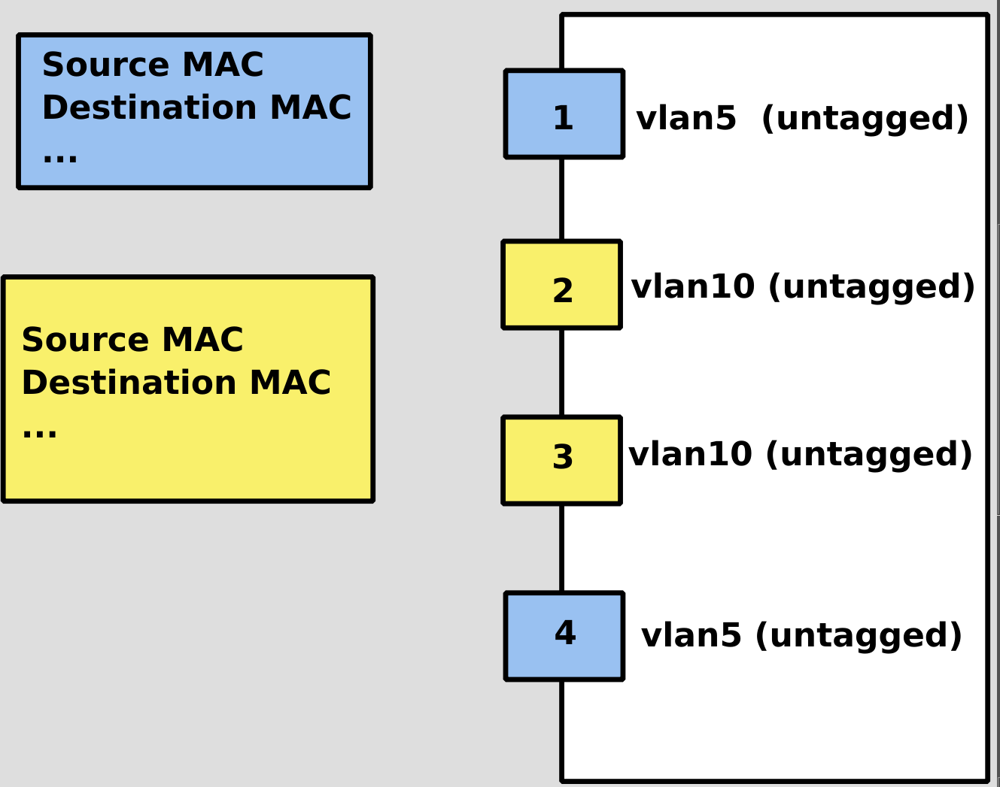

Условно, весь трафик можно поделить на нетегированный и тегированный. В тегированном трафике на всех пакетах есть идентификатор VLAN-а. Обычно на свитчах в сторону компьютеров настроены нетегированные порты - т.е. вы подключаете кабель к компьютеру и всё работает. При этом сам порт на свитче может быть помечен как принадлежащий к какому-то VLAN-у. Условно, я делю сетку на юзеров и сервера, юзеров я держу в 5 влане, а сервера в 10. И юзеры, и сервера подключены к одному свитчу, но я знаю, что за портом 1 находится юзер, а за портом 2 - сервер. И на свитче я настраиваю, что первый порт - это нетегированный порт влана 5, а второй порт - тоже нетегированный, но там уже влан 10. При этом на пользовательском и серверном компе ничего не надо настраивать. Трафик, приходящий на первый порт, будет общим с портом 4. Т.е. они в одном broadcast домене, а порты 2 и 3 в другом. 

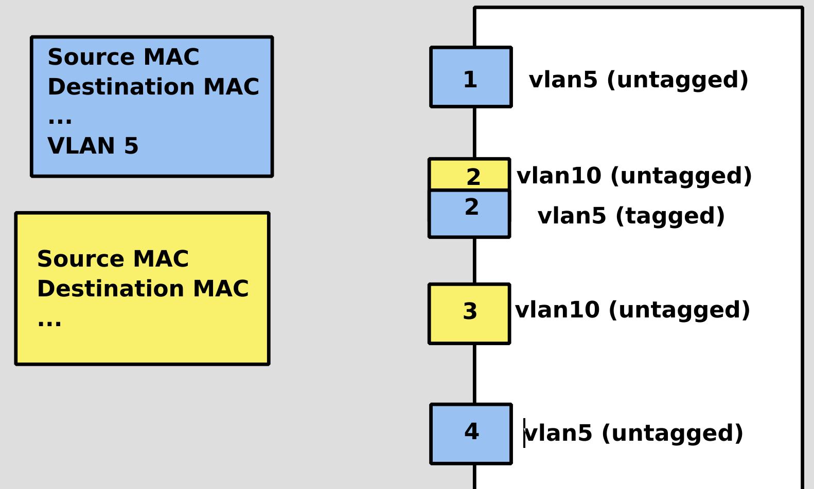

Но, предположим, я хочу, чтобы сервер, подключеный ко второму порту, был одновременно и в пользовательском влане, и в серверном. Я могу либо отдельным кабелем подключиться к порту 4, либо настроить, чтобы на порту 2 также был доступен 5-ый влан. А чтобы трафик не путался, надо ко всем пакетам, которые сервер отправляет на 5-ый влан, добавлять VLAN ID, а на свитче настроить, чтобы он принимал на втором порту влан 5 в тегированном режиме.

В итоге, если сервер захочет отправить что-то на VLAN 10 - то он просто отправит такой пакет как обычный. А если сервер захочет отправить что-то в 5-ый влан, то ему нужно будет добавить к этому пакету тег. Свитч, получив пакет с таким тегом, отправит его на любой из портов с вланом 5. При этом, когда пакет будет выходить из нетегированного порта, свитч уберёт метку. Тоже самое в обратном направлении - если компьютер на порту 1 захочет отправить что-то на сервер по влану 5, то трафик в нетегированном виде придёт на свитч, затем свитч поставит на этот пакет метку и отправит его в тегированном виде на сервер. Сервер, увидя пакет с тегом, будет понимать, что это пакет с пользовательского влана. Порты, на которых нет тегов, часто называют аксес портами. На одном порту может быть только один нетегированный влан, все остальные вланы нужно тегировать, чтобы не смешивать broadcast домены. 

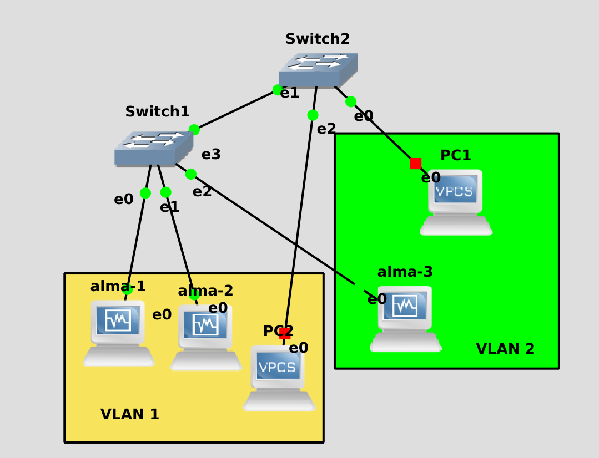

Как вы понимаете, деление зачастую происходит на уровне свитча, хотя не только и нередко на самих серверах настраиваются VLAN-ы. Они общие для сети - т.е. вы можете создать на двух разных свитчах одни и те же VLAN-ы, и тогда компьютеры, подключенные к разным свитчам, но находящиеся в одном VLAN-е будут видеть друг друга. Естественно, при условии, что свитчи связаны между собой и на обоих прописаны эти VLAN-ы.

Условно, в нарисованной схеме есть 2 VLAN-а - у одного тег 1, у второго 2. У свитча 1 на портах e0 и e1 настроен влан 1, а на порту e2 - влан 2. Есть свитч 2, у которого на порту е0 прописан влан 2, а на порту e2 - влан 1. Между первым и вторым свитчом проброшен кабель, через который должны ходить оба влана, чтобы alma3 могла видеть PC1. Alma3 подключена к свитчу 1, а чтобы достучаться до PC1, ей нужно попасть через первый свитч на второй. Порты, на которых прописаны несколько вланов, называются транк портами. Обычно их делают между двумя свитчами. Но не только.

Во многих компаниях почти вся инфраструктура строится на виртуалках. Виртуалок много, они предназначены для разных задач, а значит и сеть между ними надо сегментировать. И вот часто на портах свитчей, которые идут к серверам, прописывают много вланов, а в гипервизорах в настройках сетевых адаптеров виртуалок можно указать нужный VLAN. В итоге у вас виртуалки находятся в разных VLAN-ах.


Давайте построим такую сеть, где alma1 находится в первом VLAN-е, alma3 находится во втором, а alma2 и там, и там.

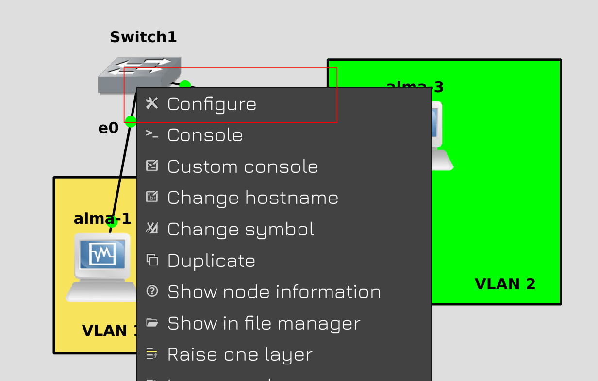

Нажмите правой кнопкой мыши на свитче и выберите Configure.

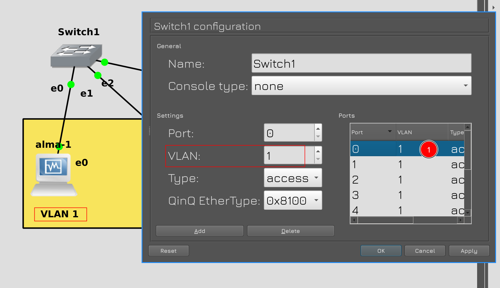

В появившемся окне в правой части будут порты, а слева можно их настраивать. Два раза ткните на порт 0, он у нас подключен к alma1. Как видите, здесь по-умолчанию прописан VLAN1 в режиме access, т.е. в нетегированном виде. Поэтому здесь мы ничего не трогаем.

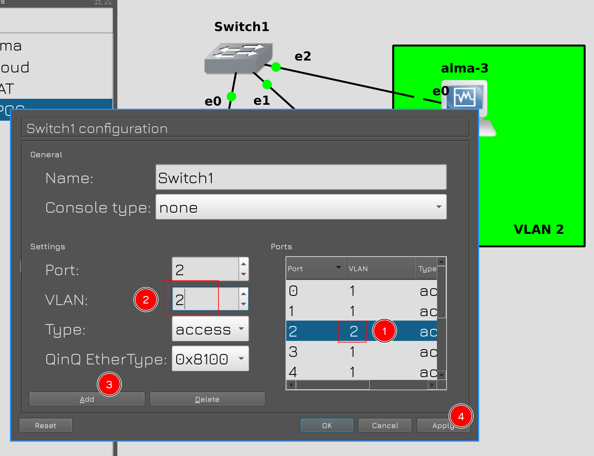

Теперь касательно alma3, он подключен к порту e2. Два раза ткните на второй порт. Поменяйте там значение VLAN на 2, затем нажмите Add. Тогда в правой панели число поменяется на 2. Теперь здесь в нетегированном виде VLAN 2.

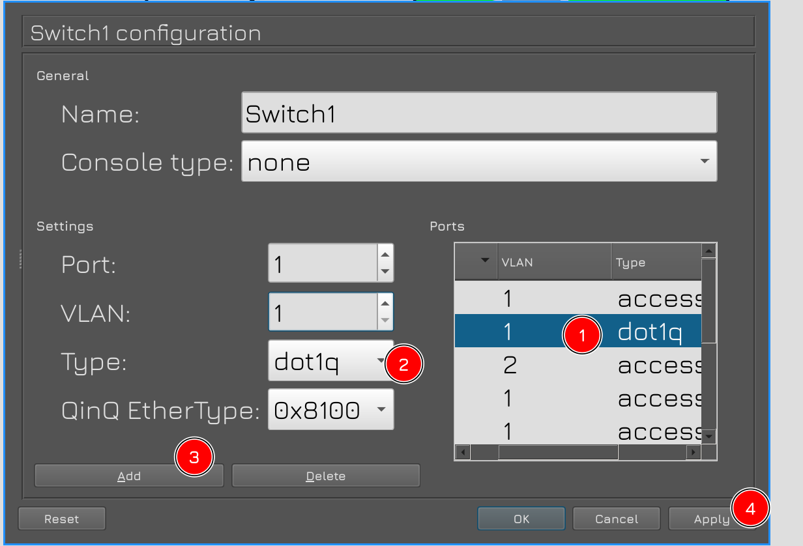

Насчёт alma2, нам нужно передавать по первому порту два влана - влан1 и влан2. Для этого дважды нажимаем на первый порт, влан не трогаем, а меняем только тип на dot1q. В стандартах VLAN-ы указаны под названием 802.1q, а dot1q - это сокращённое название. Нажимаем Add и Apply.


Теперь, чтобы проверить, работает ли изоляция, ещё раз с хоста 1 отправим ping, но на неизвестный IP адрес, скажем, 10.0.1.3:

```
ping -c 1 10.0.1.3
```

За этим адресом никакого хоста нет, компьютер не знает, к кому обращаться, поэтому он пошлёт ARP запрос. 


Этот ARP запрос мы видим на хосте 2. Это значит, что хост 1 и хост 2 всё ещё в одном броадкаст домене, так как оба подключены к влану 1.


А вот до альмы 3 запрос не дошёл, а это значит, что она не находится с хостом 1 в одном влане.


Теперь проверим работу влана 2. Пропингуем адрес с третьего хоста:

```
ping -c 1 10.0.0.2
```


На первом хосте, как и ожидалось, tcpdump молчит - потому что он не находится с третьим хостом в одном влане.


А вот хост 2 видит и эти запросы, т.е. он в одном влане с хостом 3. 


Осталось настроить, чтобы хост 2 и 3 могли друг друга пинговать, т.е. чтобы сеть между ними работала и на третьем уровне. Но мы не можем просто прописать на хосте второй IP адрес - IP адрес будет не нетегированном интерфейсе, а значит система будет просто отбрасывать пакет. Нам же нужно создать тегированный интерфейс. 


Для этого запускаем nmtui - Edit connection - Add, в списке находим VLAN и табом переходим на Create.

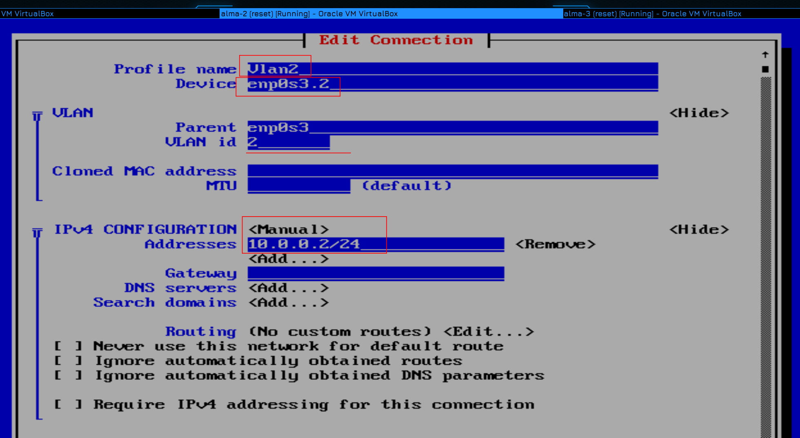

Профиль можно назвать как угодно, но для ясности назовём Vlan2. В device пишем имя интерфейса, куда подключен кабель с этим вланом, затем ставим точку и пишем VLAN ID - 2, т.е. получается enp0s3.2. После нажатия tab снизу автоматом заполнятся поля Parent и Vlan id. Ну и дальше как в обычном интерфейсе - поменяем IPv4 configuration на manual, потому что у нас нет DHCP сервера, и выставим статичный IP - 10.0.0.2/24. Сохраняем и выходим из nmtui.

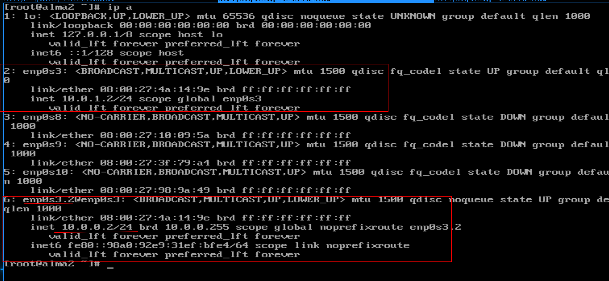

Теперь, посмотрев список интерфейсов:

```
ip a
```

можно заметить, что появился новый интерфейс - enp0s3.2 - и на нём прописан IP адрес. 

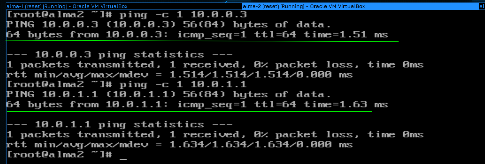

Попытаемся пингануть хосты 1 и 3:

```
ping -c 1 10.0.0.3
ping -c 1 10.0.1.1
```

alma2 видит оба хоста, т.е. она находится в двух разных броадкаст доменах, как мы этого и хотели. Таким же макаром мы могли бы добавить ещё несколько вланов, но этим уже займитесь вы.

Давайте подведём итоги. Сегодня мы с вами немного разобрали L2, поговорили о свитчах, которые там обитают и познакомились с такими понятиями, как broadcast, arp, vlan-ы и даже немного разобрали маркировку. Также мы научились прописывать VLAN-ы на сервере - а это было главным смыслом данного урока - понимать, зачем это нужно и как это делать. Мы это сделали через одну утилиту nmtui, на деле же есть и другие способы, но это лишь инструменты.